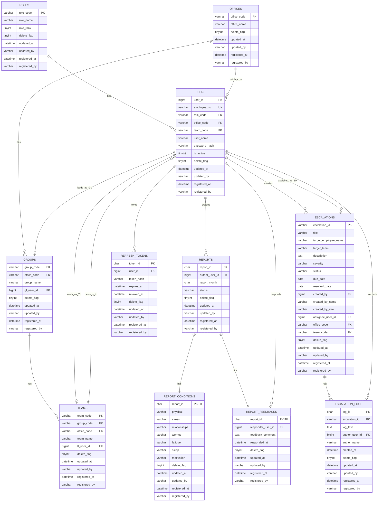

# 月報管理システム データベース設計

## 1. 目的

本書は、月報管理システムの初版DB設計(論理/物理)を定義する。
設計方針は `doc/design/api-design-policy.md` に準拠する。

## 2. 設計方針

- DBMS: `MariaDB 11.x`
- 文字コード: `utf8mb4`
- タイムゾーン: `Asia/Tokyo`
- ORM前提: `Spring Data JPA`
- トランザクションデータは日次差分バックアップ対象
- マスタとトランを分離し、将来の権限拡張を容易にする

## 3. WHOカラム標準

本システムのテーブルは、以下のWHOカラムを持つ。

- `delete_flag` (削除フラグ)
- `updated_at` (更新日時)
- `updated_by` (更新者)
- `registered_at` (登録日時)
- `registered_by` (登録者)

`delete_flag` は `0:有効 / 1:削除` とする。

## 4. 論理ER(主要エンティティ)

- `users` (ユーザー)
- `roles` (ロール)
- `offices` (営業所)
- `groups` (グループ)
- `teams` (チーム)
- `reports` (月報ヘッダ)
- `report_conditions` (月報コンディション)
- `report_feedbacks` (月報回答)
- `escalations` (エスカレーション)
- `escalation_logs` (エスカレーション対応ログ)
- `refresh_tokens` (ログイン継続用)

関係:

- `users.role_code -> roles.role_code`
- `users.office_code -> offices.office_code`
- `users.team_code -> teams.team_code`
- `groups.office_code -> offices.office_code`
- `groups.gl_user_id -> users.user_id`
- `teams.group_code -> groups.group_code`
- `teams.tl_user_id -> users.user_id`
- `reports.author_user_id -> users.user_id`
- `report_conditions.report_id -> reports.report_id`
- `report_feedbacks.report_id -> reports.report_id`
- `report_feedbacks.responder_user_id -> users.user_id`
- `escalations.created_by -> users.user_id`
- `escalations.assignee_user_id -> users.user_id`
- `escalation_logs.escalation_id -> escalations.escalation_id`
- `escalation_logs.author_user_id -> users.user_id`

### 4.1 ER図



## 5. 物理テーブル定義

## 5.1 roles

| カラム | 型 | 必須 | 説明 |
|---|---|---|---|
| role_code | varchar(20) | Y | `NG/TM/TL/GL/OM/SP/SM/SA` |
| role_name | varchar(100) | Y | 表示名 |
| role_rank | tinyint | Y | 権限序列 |
| delete_flag | tinyint(1) | Y | 削除フラグ |
| updated_at | datetime(3) | Y | 更新日時 |
| updated_by | varchar(50) | Y | 更新者 |
| registered_at | datetime(3) | Y | 登録日時 |
| registered_by | varchar(50) | Y | 登録者 |

PK: `role_code`

## 5.2 offices

| カラム | 型 | 必須 | 説明 |
|---|---|---|---|
| office_code | varchar(20) | Y | 営業所コード |
| office_name | varchar(100) | Y | 営業所名 |
| delete_flag | tinyint(1) | Y | 削除フラグ |
| updated_at | datetime(3) | Y | 更新日時 |
| updated_by | varchar(50) | Y | 更新者 |
| registered_at | datetime(3) | Y | 登録日時 |
| registered_by | varchar(50) | Y | 登録者 |

PK: `office_code`

## 5.3 groups

| カラム | 型 | 必須 | 説明 |
|---|---|---|---|
| group_code | varchar(20) | Y | グループコード |
| group_name | varchar(100) | Y | グループ名 |
| office_code | varchar(20) | Y | 所属営業所 |
| gl_user_id | bigint | Y | グループリーダー(GL)のユーザーID |
| delete_flag | tinyint(1) | Y | 削除フラグ |
| updated_at | datetime(3) | Y | 更新日時 |
| updated_by | varchar(50) | Y | 更新者 |
| registered_at | datetime(3) | Y | 登録日時 |
| registered_by | varchar(50) | Y | 登録者 |

PK: `group_code`
FK: `office_code -> offices.office_code`
FK: `gl_user_id -> users.user_id`

## 5.4 teams

| カラム | 型 | 必須 | 説明 |
|---|---|---|---|
| team_code | varchar(20) | Y | チームコード |
| team_name | varchar(100) | Y | チーム名 |
| group_code | varchar(20) | Y | 所属グループ |
| office_code | varchar(20) | Y | 所属営業所 |
| tl_user_id | bigint | Y | チームリーダー(TL)のユーザーID |
| delete_flag | tinyint(1) | Y | 削除フラグ |
| updated_at | datetime(3) | Y | 更新日時 |
| updated_by | varchar(50) | Y | 更新者 |
| registered_at | datetime(3) | Y | 登録日時 |
| registered_by | varchar(50) | Y | 登録者 |

PK: `team_code`
FK: `group_code -> groups.group_code`
FK: `office_code -> offices.office_code`
FK: `tl_user_id -> users.user_id`

## 5.5 users

| カラム | 型 | 必須 | 説明 |
|---|---|---|---|
| user_id | bigint | Y | 内部ID |
| employee_no | varchar(20) | Y | 社員番号 |
| user_name | varchar(100) | Y | 氏名 |
| password_hash | varchar(255) | Y | BCryptハッシュ |
| role_code | varchar(20) | Y | ロール |
| office_code | varchar(20) | Y | 営業所 |
| team_code | varchar(20) | Y | チーム |
| is_active | tinyint(1) | Y | 有効フラグ |
| delete_flag | tinyint(1) | Y | 削除フラグ |
| updated_at | datetime(3) | Y | 更新日時 |
| updated_by | varchar(50) | Y | 更新者 |
| registered_at | datetime(3) | Y | 登録日時 |
| registered_by | varchar(50) | Y | 登録者 |

PK: `user_id`
UK: `employee_no`
FK: `role_code -> roles.role_code`
FK: `office_code -> offices.office_code`
FK: `team_code -> teams.team_code`

## 5.6 reports

| カラム | 型 | 必須 | 説明 |
|---|---|---|---|
| report_id | char(26) | Y | ULID |
| report_month | char(7) | Y | `yyyy-MM` |
| sales_info | text | N | 営業情報 |
| next_month_overtime_hours | smallint | N | 来月残業見込み |
| next_month_overtime_reason | varchar(255) | N | 理由 |
| this_month_overtime_hours | smallint | N | 今月残業見込み |
| this_month_overtime_reason | varchar(255) | N | 理由 |
| comments | text | N | コメント |
| status | varchar(30) | Y | `DRAFT/SUBMITTED/PENDING_FEEDBACK/FEEDBACKED` |
| author_user_id | bigint | Y | 作成者 |
| office_code | varchar(20) | Y | 作成時点営業所 |
| team_code | varchar(20) | Y | 作成時点チーム |
| delete_flag | tinyint(1) | Y | 削除フラグ |
| updated_at | datetime(3) | Y | 更新日時 |
| updated_by | varchar(50) | Y | 更新者 |
| registered_at | datetime(3) | Y | 登録日時 |
| registered_by | varchar(50) | Y | 登録者 |

PK: `report_id`
UK: `uk_reports_author_month_alive (author_user_id, report_month, delete_flag)`
FK: `author_user_id -> users.user_id`

## 5.7 report_conditions

| カラム | 型 | 必須 | 説明 |
|---|---|---|---|
| report_id | char(26) | Y | 月報ID |
| physical | varchar(10) | Y | `BEST/GOOD/WARN/NG` |
| stress | varchar(10) | Y | `BEST/GOOD/WARN/NG` |
| relationships | varchar(10) | Y | `BEST/GOOD/WARN/NG` |
| worries | varchar(10) | Y | `BEST/GOOD/WARN/NG` |
| fatigue | varchar(10) | Y | `BEST/GOOD/WARN/NG` |
| sleep | varchar(10) | Y | `BEST/GOOD/WARN/NG` |
| motivation | varchar(10) | Y | `BEST/GOOD/WARN/NG` |
| delete_flag | tinyint(1) | Y | 削除フラグ |
| updated_at | datetime(3) | Y | 更新日時 |
| updated_by | varchar(50) | Y | 更新者 |
| registered_at | datetime(3) | Y | 登録日時 |
| registered_by | varchar(50) | Y | 登録者 |

PK: `report_id`
FK: `report_id -> reports.report_id`

## 5.8 report_feedbacks

| カラム | 型 | 必須 | 説明 |
|---|---|---|---|
| report_id | char(26) | Y | 月報ID |
| feedback_comment | text | N | フィードバック本文 |
| responder_user_id | bigint | Y | 回答者 |
| responded_at | datetime(3) | Y | 回答日時 |
| delete_flag | tinyint(1) | Y | 削除フラグ |
| updated_at | datetime(3) | Y | 更新日時 |
| updated_by | varchar(50) | Y | 更新者 |
| registered_at | datetime(3) | Y | 登録日時 |
| registered_by | varchar(50) | Y | 登録者 |

PK: `report_id`
FK: `report_id -> reports.report_id`
FK: `responder_user_id -> users.user_id`

## 5.9 escalations

| カラム | 型 | 必須 | 説明 |
|---|---|---|---|
| escalation_id | varchar(20) | Y | エスカレーションID（例: `ESC001`） |
| title | varchar(200) | Y | 案件タイトル |
| target_employee_name | varchar(100) | Y | 対象メンバー氏名 |
| target_team | varchar(100) | Y | 対象チーム名 |
| description | text | N | 詳細内容 |
| severity | varchar(10) | Y | `LOW/MEDIUM/HIGH` |
| status | varchar(10) | Y | `PENDING/ONGOING/RESOLVED` |
| due_date | date | Y | 対応期日 |
| resolved_date | date | N | 完了期日（`status=RESOLVED` の場合必須） |
| created_by | bigint | Y | 起票者ユーザーID |
| created_by_name | varchar(100) | Y | 起票者氏名（スナップショット） |
| created_by_role | varchar(20) | Y | 起票者ロール（スナップショット） |
| assignee_user_id | bigint | N | 対応担当者ユーザーID（一度設定した場合、未設定への変更は不可） |
| office_code | varchar(20) | Y | 起票時点営業所（スコープ判定用） |
| team_code | varchar(20) | Y | 起票時点チーム（スコープ判定用） |
| delete_flag | tinyint(1) | Y | 削除フラグ |
| updated_at | datetime(3) | Y | 更新日時 |
| updated_by | varchar(50) | Y | 更新者 |
| registered_at | datetime(3) | Y | 登録日時 |
| registered_by | varchar(50) | Y | 登録者 |

PK: `escalation_id`
FK: `created_by -> users.user_id`
FK: `assignee_user_id -> users.user_id`

## 5.10 escalation_logs

| カラム | 型 | 必須 | 説明 |
|---|---|---|---|
| log_id | char(26) | Y | ログID（ULID） |
| escalation_id | varchar(20) | Y | 対象エスカレーションID |
| log_text | text | Y | 対応ログ本文 |
| author_user_id | bigint | Y | 記録者ユーザーID |
| author_name | varchar(100) | Y | 記録者氏名（スナップショット） |
| created_at | datetime(3) | Y | 記録日時 |
| delete_flag | tinyint(1) | Y | 削除フラグ（追記専用のため常に 0） |
| updated_at | datetime(3) | Y | 更新日時 |
| updated_by | varchar(50) | Y | 更新者 |
| registered_at | datetime(3) | Y | 登録日時 |
| registered_by | varchar(50) | Y | 登録者 |

PK: `log_id`
FK: `escalation_id -> escalations.escalation_id`
FK: `author_user_id -> users.user_id`

## 5.11 refresh_tokens

| カラム | 型 | 必須 | 説明 |
|---|---|---|---|
| token_id | char(26) | Y | トークンID |
| user_id | bigint | Y | ユーザーID |
| token_hash | varchar(255) | Y | トークンハッシュ |
| expires_at | datetime(3) | Y | 期限 |
| revoked_at | datetime(3) | N | 失効日時 |
| delete_flag | tinyint(1) | Y | 削除フラグ |
| updated_at | datetime(3) | Y | 更新日時 |
| updated_by | varchar(50) | Y | 更新者 |
| registered_at | datetime(3) | Y | 登録日時 |
| registered_by | varchar(50) | Y | 登録者 |

PK: `token_id`
FK: `user_id -> users.user_id`

## 6. インデックス設計

- `users`
- `uk_users_employee_no (employee_no)`
- `idx_users_role_office_team (role_code, office_code, team_code)`
- `reports`
- `uk_reports_author_month_alive (author_user_id, report_month, delete_flag)`
- `idx_reports_author_month (author_user_id, report_month desc)`
- `idx_reports_scope_month (office_code, team_code, report_month desc)`
- `idx_reports_status_month (status, report_month desc)`
- `idx_reports_updated_at (updated_at desc)`
- `report_feedbacks`
- `idx_feedbacks_responder (responder_user_id, responded_at desc)`
- `groups`
- `idx_groups_office (office_code)`
- `teams`
- `idx_teams_group (group_code)`
- `idx_teams_office (office_code)`
- `escalations`
- `idx_escalations_office_team (office_code, team_code, status)`
- `idx_escalations_created_by (created_by, status)`
- `idx_escalations_assignee (assignee_user_id, status)`
- `idx_escalations_due_date (due_date)`
- `escalation_logs`
- `idx_escalation_logs_escalation (escalation_id, created_at)`

## 7. DDLサンプル(初版)

```sql
create table roles (
  role_code varchar(20) not null,
  role_name varchar(100) not null,
  role_rank tinyint not null,
  delete_flag tinyint(1) not null default 0,
  updated_at datetime(3) not null,
  updated_by varchar(50) not null,
  registered_at datetime(3) not null,
  registered_by varchar(50) not null,
  primary key (role_code)
) engine=InnoDB default charset=utf8mb4;

create table offices (
  office_code varchar(20) not null,
  office_name varchar(100) not null,
  delete_flag tinyint(1) not null default 0,
  updated_at datetime(3) not null,
  updated_by varchar(50) not null,
  registered_at datetime(3) not null,
  registered_by varchar(50) not null,
  primary key (office_code)
) engine=InnoDB default charset=utf8mb4;

-- groups/teams はリーダー(GL/TL)を users.user_id で参照するが、
-- users.team_code が teams を参照するため相互参照となる。
-- gl_user_id / tl_user_id の FK 制約は users 作成後に ALTER TABLE で付与する。
create table groups (
  group_code varchar(20) not null,
  group_name varchar(100) not null,
  office_code varchar(20) not null,
  gl_user_id bigint not null,
  delete_flag tinyint(1) not null default 0,
  updated_at datetime(3) not null,
  updated_by varchar(50) not null,
  registered_at datetime(3) not null,
  registered_by varchar(50) not null,
  primary key (group_code),
  key idx_groups_office (office_code),
  constraint fk_groups_office foreign key (office_code) references offices (office_code)
) engine=InnoDB default charset=utf8mb4;

create table teams (
  team_code varchar(20) not null,
  team_name varchar(100) not null,
  group_code varchar(20) not null,
  office_code varchar(20) not null,
  tl_user_id bigint not null,
  delete_flag tinyint(1) not null default 0,
  updated_at datetime(3) not null,
  updated_by varchar(50) not null,
  registered_at datetime(3) not null,
  registered_by varchar(50) not null,
  primary key (team_code),
  key idx_teams_group (group_code),
  key idx_teams_office (office_code),
  constraint fk_teams_group foreign key (group_code) references groups (group_code),
  constraint fk_teams_office foreign key (office_code) references offices (office_code)
) engine=InnoDB default charset=utf8mb4;

create table users (
  user_id bigint not null auto_increment,
  employee_no varchar(20) not null,
  user_name varchar(100) not null,
  password_hash varchar(255) not null,
  role_code varchar(20) not null,
  office_code varchar(20) not null,
  team_code varchar(20) not null,
  is_active tinyint(1) not null default 1,
  delete_flag tinyint(1) not null default 0,
  updated_at datetime(3) not null,
  updated_by varchar(50) not null,
  registered_at datetime(3) not null,
  registered_by varchar(50) not null,
  primary key (user_id),
  unique key uk_users_employee_no (employee_no),
  key idx_users_role_office_team (role_code, office_code, team_code),
  constraint fk_users_role foreign key (role_code) references roles (role_code),
  constraint fk_users_office foreign key (office_code) references offices (office_code),
  constraint fk_users_team foreign key (team_code) references teams (team_code)
) engine=InnoDB default charset=utf8mb4;

alter table groups add constraint fk_groups_gl foreign key (gl_user_id) references users (user_id);
alter table teams add constraint fk_teams_tl foreign key (tl_user_id) references users (user_id);

create table reports (
  report_id char(26) not null,
  report_month char(7) not null,
  sales_info text null,
  next_month_overtime_hours smallint null,
  next_month_overtime_reason varchar(255) null,
  this_month_overtime_hours smallint null,
  this_month_overtime_reason varchar(255) null,
  comments text null,
  status varchar(30) not null,
  author_user_id bigint not null,
  office_code varchar(20) not null,
  team_code varchar(20) not null,
  delete_flag tinyint(1) not null default 0,
  updated_at datetime(3) not null,
  updated_by varchar(50) not null,
  registered_at datetime(3) not null,
  registered_by varchar(50) not null,
  primary key (report_id),
  unique key uk_reports_author_month_alive (author_user_id, report_month, delete_flag),
  key idx_reports_author_month (author_user_id, report_month desc),
  key idx_reports_scope_month (office_code, team_code, report_month desc),
  key idx_reports_status_month (status, report_month desc),
  key idx_reports_updated_at (updated_at desc),
  constraint fk_reports_author foreign key (author_user_id) references users (user_id)
) engine=InnoDB default charset=utf8mb4;

create table report_conditions (
  report_id char(26) not null,
  physical varchar(10) not null,
  stress varchar(10) not null,
  relationships varchar(10) not null,
  worries varchar(10) not null,
  fatigue varchar(10) not null,
  sleep varchar(10) not null,
  motivation varchar(10) not null,
  delete_flag tinyint(1) not null default 0,
  updated_at datetime(3) not null,
  updated_by varchar(50) not null,
  registered_at datetime(3) not null,
  registered_by varchar(50) not null,
  primary key (report_id),
  constraint fk_report_conditions_report foreign key (report_id) references reports (report_id)
) engine=InnoDB default charset=utf8mb4;

create table report_feedbacks (
  report_id char(26) not null,
  feedback_comment text null,
  responder_user_id bigint not null,
  responded_at datetime(3) not null,
  delete_flag tinyint(1) not null default 0,
  updated_at datetime(3) not null,
  updated_by varchar(50) not null,
  registered_at datetime(3) not null,
  registered_by varchar(50) not null,
  primary key (report_id),
  key idx_feedbacks_responder (responder_user_id, responded_at desc),
  constraint fk_report_feedbacks_report foreign key (report_id) references reports (report_id),
  constraint fk_report_feedbacks_responder foreign key (responder_user_id) references users (user_id)
) engine=InnoDB default charset=utf8mb4;

create table escalations (
  escalation_id varchar(20) not null,
  title varchar(200) not null,
  target_employee_name varchar(100) not null,
  target_team varchar(100) not null,
  description text null,
  severity varchar(10) not null,
  status varchar(10) not null,
  due_date date not null,
  resolved_date date null,
  created_by bigint not null,
  created_by_name varchar(100) not null,
  created_by_role varchar(20) not null,
  assignee_user_id bigint null,
  office_code varchar(20) not null,
  team_code varchar(20) not null,
  delete_flag tinyint(1) not null default 0,
  updated_at datetime(3) not null,
  updated_by varchar(50) not null,
  registered_at datetime(3) not null,
  registered_by varchar(50) not null,
  primary key (escalation_id),
  key idx_escalations_office_team (office_code, team_code, status),
  key idx_escalations_created_by (created_by, status),
  key idx_escalations_assignee (assignee_user_id, status),
  key idx_escalations_due_date (due_date),
  constraint fk_escalations_created_by foreign key (created_by) references users (user_id),
  constraint fk_escalations_assignee foreign key (assignee_user_id) references users (user_id)
) engine=InnoDB default charset=utf8mb4;

create table escalation_logs (
  log_id char(26) not null,
  escalation_id varchar(20) not null,
  log_text text not null,
  author_user_id bigint not null,
  author_name varchar(100) not null,
  created_at datetime(3) not null,
  delete_flag tinyint(1) not null default 0,
  updated_at datetime(3) not null,
  updated_by varchar(50) not null,
  registered_at datetime(3) not null,
  registered_by varchar(50) not null,
  primary key (log_id),
  key idx_escalation_logs_escalation (escalation_id, created_at),
  constraint fk_escalation_logs_escalation foreign key (escalation_id) references escalations (escalation_id),
  constraint fk_escalation_logs_author foreign key (author_user_id) references users (user_id)
) engine=InnoDB default charset=utf8mb4;

create table refresh_tokens (
  token_id char(26) not null,
  user_id bigint not null,
  token_hash varchar(255) not null,
  expires_at datetime(3) not null,
  revoked_at datetime(3) null,
  delete_flag tinyint(1) not null default 0,
  updated_at datetime(3) not null,
  updated_by varchar(50) not null,
  registered_at datetime(3) not null,
  registered_by varchar(50) not null,
  primary key (token_id),
  constraint fk_refresh_tokens_user foreign key (user_id) references users (user_id)
) engine=InnoDB default charset=utf8mb4;
```

## 8. データアクセス方針(JPA)

- `Report` を集約ルートとして `ReportCondition` と `ReportFeedback` を 1:1 で管理する。
- 閲覧範囲絞り込みは Repository 層でロール別Specificationを組み立てる。
- 一覧はN+1回避のため、必要に応じて `EntityGraph` または DTO投影を使用する。
- `delete_flag = 0` を共通検索条件として扱う。

## 9. バックアップ/監査

- バックアップ対象: `reports`, `report_conditions`, `report_feedbacks`, `escalations`, `escalation_logs`, `refresh_tokens`
- 取得頻度: 1日1回差分
- 監査ログとの突合用に、APIの `requestId` をログに保持する。

## 10. 移行観点(現行から)

- 現行の簡易項目(社員情報、月報提出有無判定)を本設計に統合する。
- 既存ロールコード(`KengenCd`)とのマッピングテーブルを移行時に用意する。
- UIの `◎/○/▲/×` は保存時に `BEST/GOOD/WARN/NG` に変換し、取得時に逆変換する。
- MariaDBへ移行するため、MySQL依存のDDL/関数利用は排除する。
